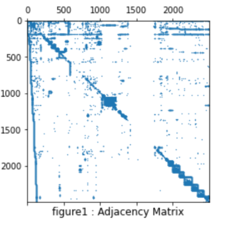
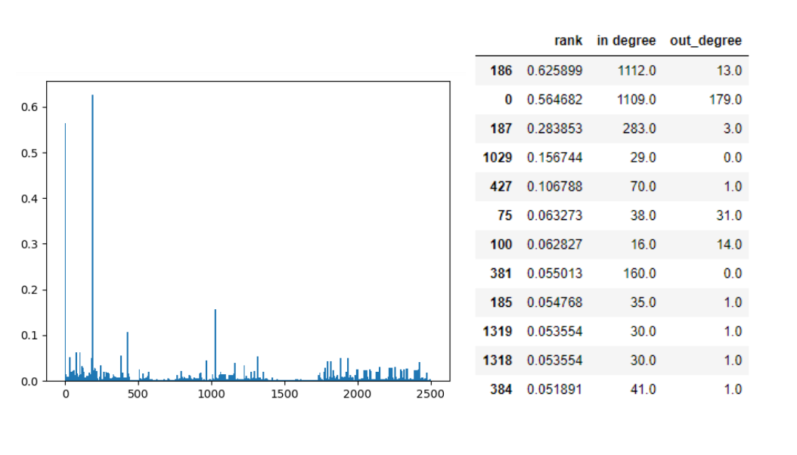

# Page-Rank-Algorithm
The following project is an assignmetn completed during the course: Linear Algebra for large scale system. Please refer to the [report](/281654.pdf) for details on the project.
The [code](/eig_S281654) is written in python language. Please keep the [graph](/graph.txt) in the same directory when executing the file.
The following figure shows the graph links in matrix form:
   
The figure below reveals the rank of pages where as the top ranked pages are given in the adjacent table:   

